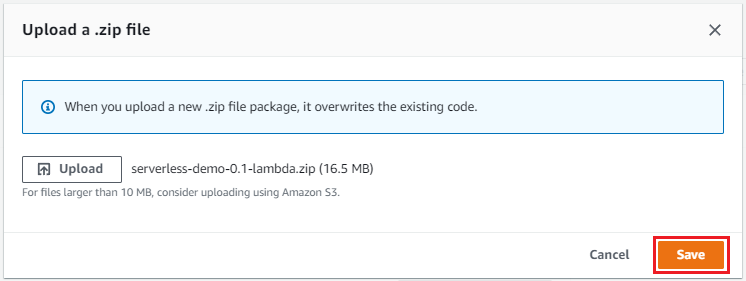
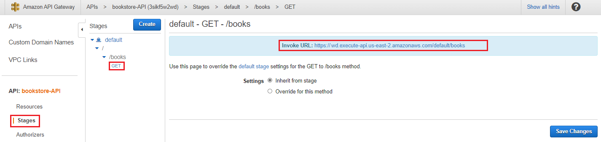

# Creating a Multi-Cloud Serverless Function Using Micronaut and GraalVM

Micronaut features low-level integration with different serverless platforms so integrating directly with AWS Lambda, Oracle Functions, Google Cloud Functions and Azure Functions is relatively straightforward. In this lab, we'll demonstrate how to develop serverless applications in a completely cloud agnostic manner using Micronaut and deploy them efficiently with GraalVM native image.

### Credits
The following lab is based on a talk by Graeme Rocher which you can view [here](https://www.youtube.com/watch?v=76JPU9cyuLk).

### Prerequisites

For this lab, we'll used Java 17 so you'll need Gradle 7.3.3. or higher.  If you're using VSCode, it may be helpful to have the [Gradle extension](https://marketplace.visualstudio.com/items?itemName=vscjava.vscode-gradle) installed.

### Creating the Function

Let's begin by creating a basic function.  In our example, we'll create a `bookstore` function that returns book titles.

Clone the repository:

```
$ git clone https://github.com/swseighman/MultiCloud-Serverless.git
```
Change directory:
```
$ cd MultiCloud-Serverless
```

To build the Micronaut application, create a runnable JAR file by executing:

```
$ ./gradlew assemble
```

Next, we'll generate a GraalVM native image inside a container and then create a `zip` file deployable to AWS Lambda using a custom runtime.

```
$ ./gradlew buildNativeLambda
```
The `buildNativeLambda` option also executes the `dockerfileNative` (which builds a Docker File for for GraalVM Native Image) and `dockerBuildNative` (which builds a Native Docker Image using GraalVM Native Image) tasks in the background.

As a result, a `zip` file is created (example: `build/libs/serverless-demo-0.1.zip`) containing bootstrap information and the function.

### Deploy Using AWS Lambda

First, within the AWS Console, search for **lambda**:


Select **Lambda**:


We'll need to create a function, click on the **Create function** button:


Enter information for our function and click on the **Create function** button:


Once our function has been created, we can upload our custom code. Under the **Code Source** section, click on the **Upload** button and choose **.zip file**:


Choose the `serverless-demo-0.1-lambda.zip` file located in the `build/libs` directory:


Click on the **Save** button (may take a minute or two to upload):




Once the custom code has been uploaded, we can test our lambda function.

Click on the **Test** tab.

Choose **New event**.

Choose **apigateway-aws-proxy** as the Template.

Enter a name (example: **test-event**).

Enter the following info which will be passed to the function:

```
{
  "path": "/books",
  "httpMethod": "GET"
}
```
Finally, click on the **Save changes** button.


Click on the **Test** button (on the far right of the UI).  If all goes well, you should see an **Execution results: succeeded (logs)** message highlighted in green.


Click on the **Details** to see the results:


In the **body** section of the response, you should see the books listed:

```
"body": "["Learning Micronaut on AWS Lambda","Micronaut Serverless on AWS Lambda"]",
```
Also notice the **Billed Duration**, if you click the **Test** button a few more times, the duration will shrink to **~2ms** (thanks to GraalVM native image).  

That's fast!

#### Configuring the API Gateway

Now that we have successfully created and tested our function, let's create a trigger to expose the function.

Click on the **+ Add trigger** button.


From the dropdown, choose **API Gateway**.

Choose **REST API**.

For the purposes of this simple demo, we'll keep the **Security -> Open**.

Click **Add**.


Next, we'll need to create a Resource that corresponds to our `/books` endpoint in our code. Click on the **bookstore-API** link in the **Trigger** section.


Click on the `/bookstore` link, then click on **Actions -> Delete Resource**:


Confirm the deletion:


Next, we'll create a new Resource.  Click on **Actions -> Create Resource**:


Add the following parameters then click on **Create Resource**:


Our new Resource has been created:


Next, we'll need to add a Method (GET).  Click on the `/books` link then **Actions -> Create Method**:


In the dropdown, choose **GET**:


 Then click the small checkmark:
 


On the next screen, enable **Use Proxy Integration** enter **bookstore** as the Lambda Function (should auto-complete as you type).  The click the **Save** button:


Grant permission for the function:


Now we have a new Resource and Method so let's test everything is working ass expected.  Click on the **Test** icon in the Method:


At the bottom of the page, click on the **Test** button.  You should see output on the screen with the expected response:


Lasts steps deploy the API. Click on **Actions -> Deploy API**:


Choose the **default** Deployment Stage and click the **Deploy button**:


The API is deployed:


Under the **Stages** section, click on the **default -> /books -> GET** link to see the URL created for your Lambda function:




You can also hit the API from the command line:

```
$ curl https://xxxxxx.execute-api.us-east-2.amazonaws.com/default/books
["Learning Micronaut on AWS Lambda","Micronaut Serverless on AWS Lamba"]
```
Congratulations! You have successfully created and deployed a Lambda function and created a resource so that you can access a public URI.

### Deploy Using Oracle Functions

Within the `build.gradle` file, you'll need to make some changes to build an Oracle function.


> #### Micronaut Tip
>
> Using the `mn` command option `feature-diff` from the root of a Micronaut project, you can create a diff of the changes that need to be applied to enable a feature.
>
>For example, to change our current lambda-based function to an Oracle Function we would execute the following command:
>
>```
>$ mn feature-diff --features oracle-function
>
>... <snipped> 
>
> micronaut {
>-    runtime("lambda")
>+    runtime("oracle_function")
>     testRuntime("junit5")
>     processing {
>         incremental(true)
>@@ -20,13 +20,13 @@
> }
>+
>+
>+dockerfileNative {
>+  args("-XX:MaximumHeapSizePercent=80")
>+}
>+nativeImage {
>+    args("--initialize-at-build-time=com.example")
>+}
>+dockerBuild {
>+    images = ["[REGION].ocir.io/[TENANCY]/[REPO]/$project.name:$project.version"]
>+}
>+
>+dockerBuildNative {
>+    images = ["[REGION].ocir.io/[TENANCY]/[REPO]/$project.name-native:$project.version"]
>+}
>```
>
>The output will recommend changes to your code to support an Oracle Function.

### Summary